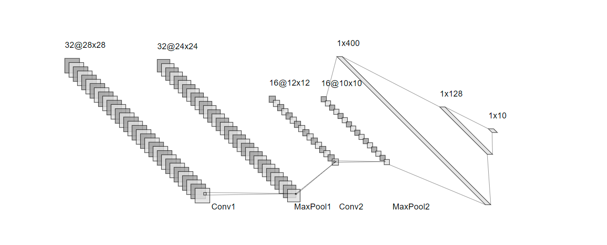
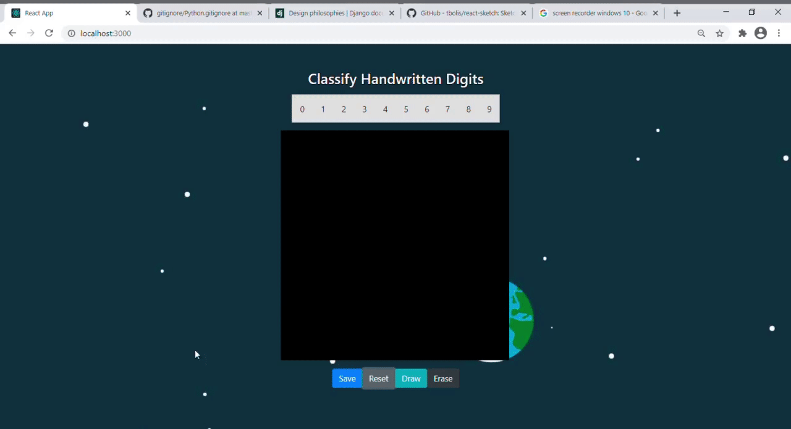

# Handwritten Digits Recognition Web App

Handwritten Digits Recognition Web App, as you might have already guessed, is a web app where one can play around(once it's is deployed) and let a Machine Learning model(instead of using a pretrained model from the internet, I coded one from scratch with test accuracy of 98%) recognize the digit that's written.

For the frontend, I used React.js with the Axios library to take care of the http request/response in the frontend and for the backend, I used Django Rest Framework. I built the classifier with PyTorch.

For the time being, the app works like a charm only in my local instance. I have planned to incorporate some more things(see todo section) before I deploy it to the cloud. I'll link all the resources that helped me, down below.

## Installation

1. Clone the repository and go to the directory
2. Install the node modules

```
cd draw-app
npm install
```

3.  Install pip dependencies

```
pip install -r requirements.txt
```

## Stacks

- Frontend - React.js
- Backend - Django Rest Framework
- Classifier - PyTorch

## Usage

1. Start the servers
   - To start the frontend server
   ```
   cd draw-app
   npm start
   ```
   - To start the backend server
   ```
   cd backend
   python manage.py runserver
   ```
2. Playing around with the MNIST classifier
   - To train the model
   ```
   cd classifier
   python train.py
   ```
   - To run the prediction
   ```
   cd classifier
   python predict.py
   ```

## Model Architecture



## Demo



## Todo

1. Migrate the SQLite database to PostgreSQL database
2. Snub django's core philosophy of "Fat Models, Skinny Views" if need be
3. Make the predictions part outside of the http request/response cycle by introducing Advanced Message Queuing Protocol (AMQP)
4. Create a container image of the app that is lightweight, standalone, executable form that packages up code and all its dependencies using Docker
5. Deploy the app in a cloud platform (heroku or digital ocean or aws)

## Contributing

Pull requests are welcome. If you have any inkling of how to accomplish the missions in the todo section, you have my attention.

## Resources

1. Project idea and reference - This [amazing playlist ](https://youtu.be/ePWaHLtsz2U) by [Pyplane](https://www.pyplane.com/)
2. MNIST dataset - [The MNIST Database](http://yann.lecun.com/exdb/mnist/)
3. Loading the images and labels from idx.ubyte.gz file - [This stack overflow answer](https://stackoverflow.com/a/53570674)
4. PyTorch Implementation - [PyTorch Deep Learning Hands-On: Build CNNs, RNNs, GANs, reinforcement learning, and more, quickly and easily](https://www.amazon.com/Hands-Deep-Learning-PyTorch-Facebooks/dp/1788834135) by Sherin Thomas and Sudhanshu Passi
5. PyTorch DataLoader, setting up training and prediction - [PyTorch's comprehensive, well-written documentation](https://pytorch.org/docs/stable/index.html)
6. Django design principles - [Django Philosophy](https://docs.djangoproject.com/en/3.2/misc/design-philosophies/)
7. Sketching board react component - [react-sketch](https://github.com/tbolis/react-sketch)
8. React Hooks - [react.js documentation](https://reactjs.org/docs/hooks-intro.html)
9. Generate LeNet style model architecture image online - [This web app](http://alexlenail.me/NN-SVG/LeNet.html)

## License

[MIT](https://choosealicense.com/licenses/mit/)
